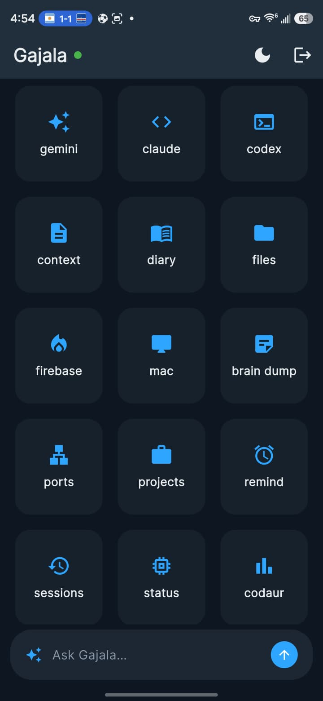
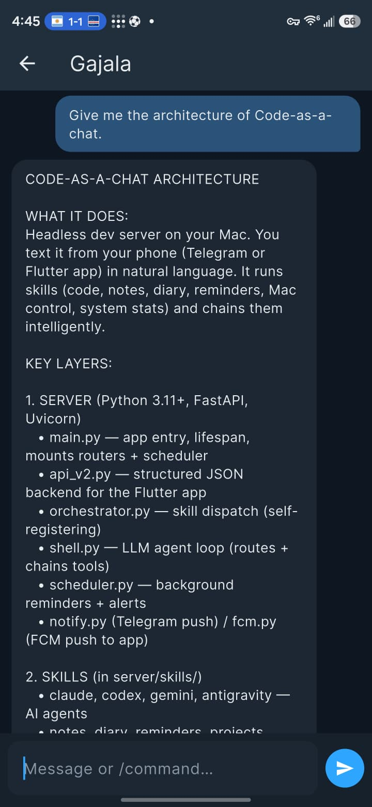
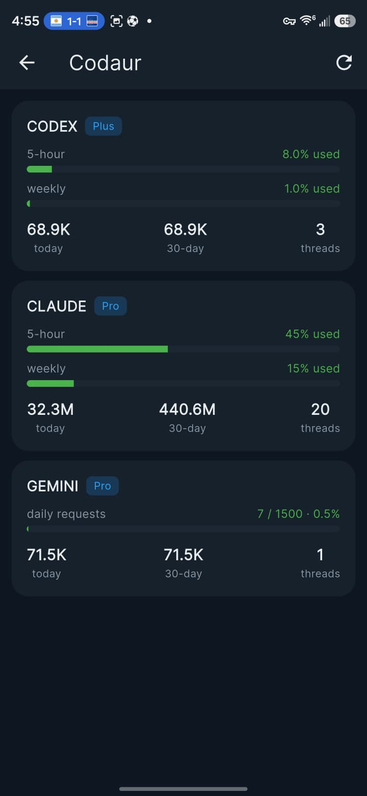
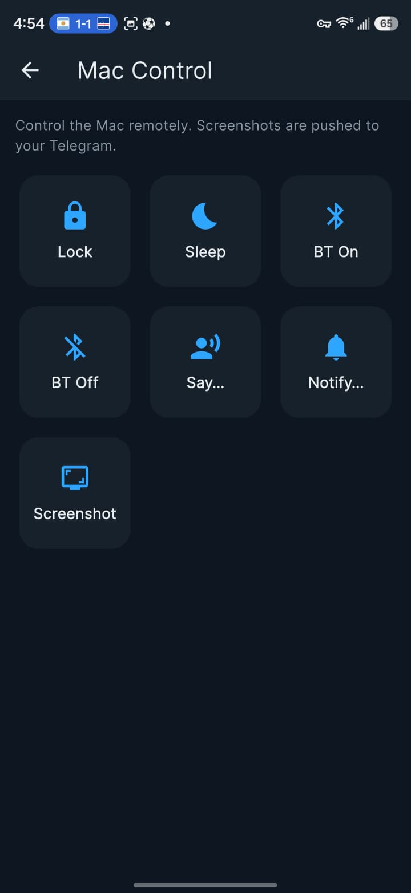

<h1 align="center">Code-as-a-Chat</h1>

<p align="center">
  <b>Your Mac is the server. Your phone is the terminal. The language is English.</b>
</p>

<p align="center">
  <a href="#quickstart">Quickstart</a> ·
  <a href="#screenshots">Screenshots</a> ·
  <a href="#meet-gajala">Meet Gajala</a> ·
  <a href="#skills">Skills</a> ·
  <a href="#the-gajala-app">App</a> ·
  <a href="#configuration">Config</a> ·
  <a href="LICENSE">License</a>
</p>

---

You already own the best coding setup on the planet — your Mac, with Claude Code,
Codex, and Gemini logged in. **Code-as-a-Chat hands you the keys from your
pocket.** Turn that Mac into an always-on, headless dev server and drive it from
your phone in plain language: run an agent on a project, jot a note, set a
reminder, check what's eating your CPU, lock the screen, connect a keyboard —
all over chat.

No cloud middleman. No account to sign up for. Your code and data stay on your
machine; the only things that leave are the requests to the AI CLIs you already
use. One small Python server — no Node gateway, no Docker daemon, no runtime zoo.

## Screenshots

<p align="center">
  
  
  
  
</p>
<p align="center"><sub><b>Dashboard</b> &middot; <b>Gajala</b> chat &middot; <b>Codaur</b> live usage &middot; <b>Mac</b> control</sub></p>

## Why it's built this way

Most personal-assistant projects go **wide**: every chat platform, every OS, a
marketplace of thousands of community skills. Code-as-a-Chat goes **deep** on the
one machine a developer actually cares about — their Mac.

- 🧠 **Real agents, not a wrapper.** It shells out to Claude Code / Codex /
  Gemini as full agentic CLIs on *your* hardware — not a thin model-router.
- 🔒 **Private by default.** Local-first. SQLite on disk, token-gated API,
  optional PII masking. Nothing phones home.
- 🪶 **Featherweight.** A single FastAPI process. `pip install`, run, done.
- 🍎 **Mac-native depth.** Lock, sleep, speak, screenshot, webcam, Bluetooth —
  purpose-built, not lowest-common-denominator.
- 🧩 **Add a skill = drop a file.** Skills self-register from a manifest; no
  wiring, no rebuild.

## Meet Gajala

The app has a name and an attitude. **Gajala** is the default voice — your Telugu
best friend who happens to run your Mac. (Telugu cinema fans will catch the
*Venky* wink.) He talks Tinglish, hypes you when the build passes
(*"Kummesav mava 🔥"*), lightly roasts you when you've got ten open TODOs, and
has a running gag that he's *"Gajala… from Washington DC."*

He also knows when to drop the bit — stressed, mid-incident, or asking for
something urgent? He goes quiet and just fixes it. Numbers, paths, and error
messages are always kept exact; the personality is seasoning, never the data.

Not your vibe? It's one setting:

```bash
AGENT_NAME=Jarvis
AGENT_PERSONA=professional   # plain, no-nonsense assistant voice
```

## How it works

```
   Phone                        Your Mac (always-on)
┌───────────┐   HTTPS over    ┌────────────────────────────────────────┐
│  Gajala   │   Tailscale     │  FastAPI orchestrator (server/)         │
│  Android  │◄───────────────►│   ├─ /run        shell agent (routing)  │
│    app    │                 │   ├─ /api/*      structured app backend │
└───────────┘                 │   └─ skills/     self-registering       │
┌───────────┐                 │                                         │
│ Telegram  │◄───────────────►│  scheduler (reminders, alerts)          │
│    bot    │                 │  SQLite stores in ~/.codeasachat/        │
└───────────┘                 └────────────────────────────────────────┘
                                       │ subprocess
                                       ▼
                          claude / codex / gemini CLIs
```

- **Orchestrator** (`server/`) — a FastAPI app. The `shell` skill is an LLM agent
  that plans, chains tool calls across the other skills, and formats replies for
  a phone screen.
- **Auth gateway** — every `/run` and `/api/*` request needs an `X-API-Token`
  header (auto-generated to `~/.codeasachat/api_token`); `/health` stays open.
- **Clients** — a Telegram bot (`clients/telegram_bot.py`) and a native Android
  app (`clients/gajala`, Flutter).
- **Data** — SQLite in `~/.codeasachat/` (notes, diary, reminders, conversation
  memory, registered devices).

## Skills

| | |
|---|---|
| **Code** | `claude` · `codex` · `antigravity` (Gemini) · `shell` (agent router) |
| **Work** | `notes` · `diary` · `reminders` · `projects` · `sessions` · `context` |
| **System** | `sysmon` · `ports` · `filemanager` · `usage` · `memory` |
| **Mac** | `mac` — lock, sleep, say, notify, screenshot, webcam, Bluetooth connect/disconnect |

Adding one is a single file in `server/skills/` subclassing `Skill` — it shows up
in the agent and clients automatically.

## Quickstart

**Requirements:** macOS · Python 3.11+ · the AI CLIs you want (`claude`,
`codex`, `gemini`, each logged in via its own subscription — no API keys needed).

```bash
git clone https://github.com/chandrapavan1104/code-as-a-chat.git
cd code-as-a-chat
python3 -m venv .venv && source .venv/bin/activate
pip install -r requirements.txt
cp .env.example .env          # everything has a sane default — you can start empty
uvicorn server.main:app --host 127.0.0.1 --port 8000
```

Run it as an always-on service (launchd, auto-restart on crash):

```bash
./scripts/codechat install     # start | stop | restart | status | logs | uninstall
```

Grab the token clients use:

```bash
cat ~/.codeasachat/api_token
```

## Reach it from your phone

Expose the local server privately over your tailnet (no public internet):

```bash
tailscale serve --bg 8000     # → https://<your-machine>.<tailnet>.ts.net
```

Point a client at that URL + token. Any HTTPS reverse proxy works; Tailscale just
keeps it off the open web.

## The Gajala app

`clients/gajala` — a Flutter app: a dashboard of live system stats and skills, a
chat screen (the shell agent), and rich screens for notes, reminders, diary,
projects, usage, and Mac control. Light/dark themes, secure token storage.

```bash
cd clients/gajala
flutter pub get
flutter build apk --release
```

**Push notifications (optional):** create a Firebase project, add an Android app
with the package id from `android/app/build.gradle.kts`, and drop its
`google-services.json` into `clients/gajala/android/app/`. On the server, put the
Firebase **service-account** key at `~/.codeasachat/fcm-service-account.json`
(or set `FCM_SERVICE_ACCOUNT`). Reminders and alerts then push straight to your
phone. Both credential files are gitignored — never commit them.

## Configuration

See [`.env.example`](.env.example) for every option — persona, default engine,
model, workspace directory, Telegram, usage budgets, scheduler, push. All have
defaults; an empty `.env` boots fine.

## Project layout

```
server/          FastAPI orchestrator, skills, scheduler, data stores
  ├─ skills/     one file per skill (self-registering)
  ├─ workspace.py which project a turn runs in (start here)
  ├─ api_v2.py   structured /api/* backend for the app
  ├─ fcm.py      FCM push · notify.py  Telegram push
  └─ db/         SQLite stores
clients/
  ├─ gajala/     Flutter Android app
  └─ telegram_bot.py
docs/flows/      how the tricky paths actually work
scripts/codechat launchd service manager
```

**New here?** [`docs/flows/project-switching.md`](docs/flows/project-switching.md)
explains how a turn decides which project it runs in, what a step costs, and how
to debug a turn that went wrong by reading its trace.

## Roadmap

`git` and `docker` skills · voice in/out · browser automation · approval gates
for destructive commands · no-code (`SKILL.md`) authoring.

## Contributing

Issues and PRs welcome. New skills are the easiest way in — copy an existing file
in `server/skills/`, and it wires itself up. Please keep secrets out of commits
(`.env`, service-account keys, and `google-services.json` are gitignored).

## License

[MIT](LICENSE) © 2026 Chandra Pavan Reddy
