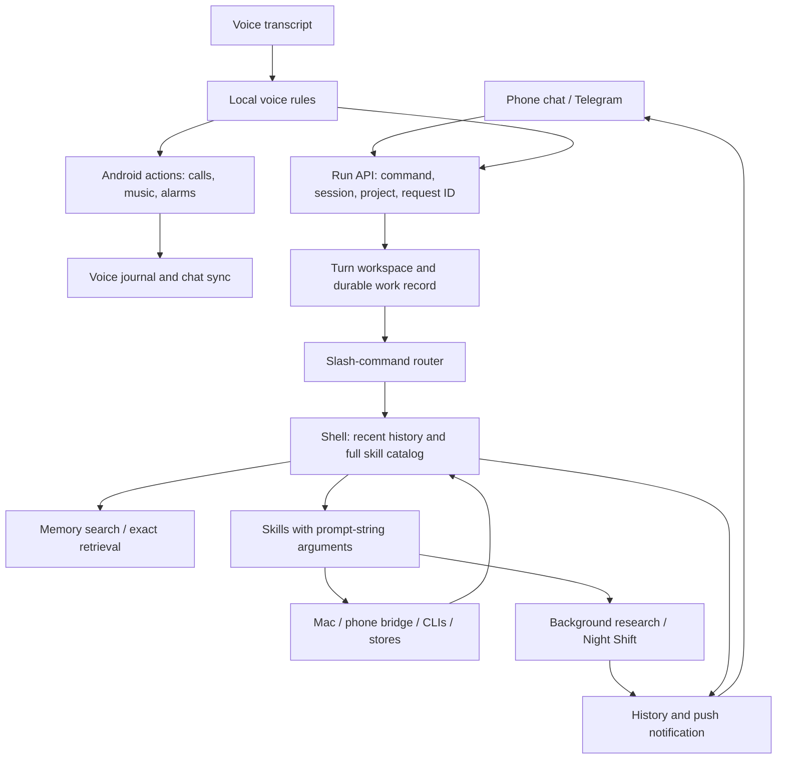
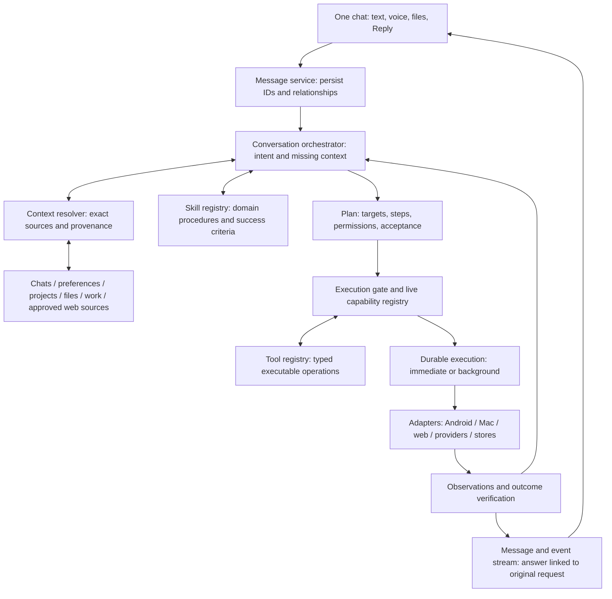

# Gajala conversation and execution baseline

Design and implementation record · October 8, 2026

Implementation: independent chat identities and persisted selection, explicit
quoted replies, origin-linked research results, shared voice/text chat identity,
local FTS and exact-source tools, domain procedure registry, typed tool registry,
and durable tool-operation leases/receipts are implemented. Existing numeric
message IDs remain stable rather than rewriting history into UUIDs; offline
requests retain stable client request IDs. Existing skill implementations remain
compatibility adapters while new operations use typed schemas. Direct YouTube
Music control is probed on the device, with advancing-position verification and
locally retained diagnostics. The phone acceptance matrix, unofficial companion
player choice, complete legacy-tool schema migration, and richer semantic preference
extraction are not claimed complete. API: `/api/conversations`,
`/api/assistant/capabilities`, `/api/assistant/operations`.

This extends `gajala-experience-redesign.md`. It is based on the deployed
October 8 implementation (source branch through 48fbcc22), inspection of the
chat/server/native code, and the user's report that music still failed after
the update. No phone trace is available for that latest attempt, so its exact
failure stage is not established. Automated build/test success did not establish
hands-free playback on the owner's device.

## Outcome

Gajala is a conversation with a dependable execution system behind it. Text,
voice, files, questions, confirmations, and background results belong to the
same message model. The user can reply to any old message and continue its
topic without restating it or accidentally reviving an unrelated task.

The assistant can discuss several subjects in one chat, retrieve relevant
material from other chats/projects, and perform work against an explicitly
resolved target. The visible chat need not move whenever the execution project
changes. Access to context does not authorize an action mentioned in that context.

## Current architecture, verified in source

- `server/orchestrator.py` maps commands to self-registering skills; ordinary
  requests reach `server/skills/shell.py`.
- `Skill` combines domain guidance and executable operations behind
  `run(prompt, **kwargs)`. The shell sees their catalog and chooses calls or a
  final JSON reply. `SkillResult` adds structured outcomes, but legacy strings
  remain. This is already a registry; it is not yet separate skill/tool layers.
- Memory loads recent session turns (default 12 pairs); individual routing
  excerpts are bounded. Memory search and exact retrieval are available, but
  resolving a reference relies on the model choosing those tools.
- App shell sessions derive from installation plus project slug. Thus project
  identity and conversation identity are coupled.
- Server history has row IDs, run links, and local receipts. The Flutter message
  model and run request have no first-class `reply_to_message_id` relation.
  `continue_task_id` continues work, not an arbitrary old conversation message.
- Research now persists jobs and later results, but the result refers to the
  original question in text rather than through a universal message relation.
- Voice actions take a separate local routing path, then synchronize logs.
  This helps offline operation, but text/voice/context semantics can diverge.
- Traces, request deduplication, workspace isolation, correction handling,
  cancellation, provider fallback, deployment coordination, and research recovery
  are valuable foundations to preserve.

## Proposed architecture

These are logical boundaries inside the existing FastAPI application, not a
requirement for multiple services, model calls, or autonomous agents. Simple
questions can answer directly; a known local command can take a validated fast
path. More difficult requests pay for retrieval and planning only when needed.

## Message, conversation, project, and work are separate identities

| Record | Essential fields and rules |
| --- | --- |
| Conversation | UUID, authenticated owner, title, optional default project, created/updated times |
| Message | Stable UUID, conversation ID, role, content/attachments, reply-to ID, timestamp, origin (text/voice/job), optional work ID |
| Message revision | Original message plus explicit edit/correction revision; preserve source wording |
| Context reference | Source type/ID, exact excerpt or artifact reference, scope, version, retrieval time, truncation indicator |
| Work | Origin message, revision, resolved project/device, plan, acceptance checks, state, deadline, cancellation, idempotency key |
| Tool operation | Work/step ID, typed arguments, actual adapter, operation key, observed outcome/evidence/error |
| Event | Increasing sequence ID, conversation/work/message IDs, event type, bounded payload |
| Preference | Explicit fact/preference, source message, scope, confidence, last confirmed time, editable/deletable |

Reply UI: swipe or long-press Reply, quoted preview above the composer, a reply
preview on the resulting bubble, and tap-to-jump to its source. An old research
reply appears as a new unread message linked to the original request; it does
not reorder history or replace the original message. Optional branches may be
added later; explicit replies are sufficient for the first release.

The backend validates that referenced messages belong to the authenticated
owner and allowed conversation scope. A client-supplied session string is not
the ownership boundary. Offline-created message IDs survive syncing unchanged.

Replying to completed work starts a new work revision only if an action is
requested. Replying 'explain that' is discussion. Replying 'cancel that' resolves
the exact active work; it must not cancel whichever task happens to be newest.

## Context resolution

The user's proposed sequence is sound with one adjustment: skill choice is
provisional until important references are resolved. A request can reveal a
different required skill after retrieval, and one request can use several skills.

1. Persist the new message and explicit reply relation before execution.
2. Resolve the replied-to message and relevant ancestors, linked work/report,
   attachments, recent conversation, and explicit corrections/preferences.
3. Identify missing facts or referents. Search owned conversations, named
   projects, CLI sessions, and approved files according to the request's scope.
4. Rank candidates by exact identifiers, recency, lexical/topic match, and
   relationship. Begin with SQLite FTS5 plus metadata; add local embeddings only
   if measured retrieval gaps justify them. Similarity is not source authority.
5. Retrieve original source text for chosen candidates. Package references with
   provenance and boundaries; request more context when an excerpt is truncated.
6. If multiple plausible projects/reports/people remain, ask one concrete
   clarification before consequential execution. Don't ask for material already
   found in owned context.
7. Finalize skills, targets, tool plan, and success checks. Retrieve again if a
   tool result exposes missing context. Preserve corrections through revisions.

Current requests/corrections take precedence over saved preferences; live
observations establish current device/project state. A past assistant claim is
not proof of completed work. Source content is data, never an instruction to
change policy or perform new actions. Private context stays local unless the
selected provider use is within the user's authorized scope.

Example: Reply to last week's provider report with 'Compare the cheapest two
for my diary.' Resolve that report exactly, retrieve the relevant budget/privacy
preferences, refresh pricing, use the research and comparison skills, then reply
to this new message. Do not clone a repo, switch the visible chat, or reuse an
old timeout receipt as the result.

## Skill pool and tool pool

**Skills describe how to accomplish a class of outcomes.** Each manifest carries
version, applicability, required/optional context, allowed tool families,
procedure, ambiguity rules, confirmation rules, acceptance checks, and eval cases.
Examples: music, calling, sourced research, coding, writing, diary mentoring,
reminders, and file sharing. Skills may compose for multi-part requests.

**Tools perform bounded operations.** Each tool defines a versioned JSON input
schema, executor (phone/Mac/service), read/write effect, authorization needs,
deadline, cancellation behavior, idempotency rules, availability probe, and
structured result. The same tool can serve many skills.

Examples: `context.read_message`, `context.search`, `project.inspect`,
`music.search`, `music.play`, `music.observe`, `contacts.resolve`, `phone.call`,
`research.submit`, `file.share`, and `mac.lock`. These names are proposed
contracts, not currently available operations.

A tool result distinguishes succeeded, failed, blocked, cancelled, and unknown,
with data, evidence, and a machine-readable error. Work additionally distinguishes
accepted, running, waiting for input, and completed. The planner defines completion
conditions before execution; adapter observations establish whether they hold.
The model explains results but cannot rewrite an unknown/failed result as success.

A live capability probe distinguishes implemented, connected, permitted, and
verified on this device/version. A tool being listed does not imply availability.
Calling confirmation is tied to resolved contact/number, work revision, and an
expiry; changing the target invalidates it. Confirmations can be spoken or typed
as a reply, with no need to recite the number unless disambiguation requires it.

## Durable execution and chat delivery

Use the existing SQLite work/event foundations. Add worker leases, heartbeats,
and per-operation records before generalizing recovery beyond read-only research.
Expired leases trigger reconciliation; inspect actual side effects before
retrying mutations. Exactly-once side effects cannot be assumed across arbitrary
third-party tools. Assign operation IDs, use provider idempotency where supported,
and reconcile uncertain outcomes rather than replaying calls or deployments.

Every outcome creates a linked assistant message. Stream progress while visible;
use a resumable event cursor and push when backgrounded. Restore after restart
from durable state, not from notification delivery. A slow job never blocks an
unrelated chat topic. Corrections explicitly target a work ID/revision, and Stop
cancels that work and its child operations. Resource-specific locks prevent
competing playback requests or simultaneous incompatible project mutations.

Text and voice use the same message/intent/work contracts. A phone executor can
perform simple local actions offline, preserve the same event record, and sync
later without re-execution. Android background restrictions remain real adapter
limits; do not claim all UI actions work while locked or backgrounded.

## Music research and proposed replacement

Primary sources inspected:

- [Music Assistant voice dispatcher](https://github.com/music-assistant/mobile-app/blob/main/androidApp/src/main/kotlin/io/music_assistant/client/VoicePlayDispatchActivity.kt):
  connects a MediaBrowser to its own playback service, sends playFromSearch,
  survives Activity teardown, and supersedes earlier pending requests safely.
  [Its Android Auto design](https://github.com/music-assistant/mobile-app/blob/main/docs/ANDROID-AUTO.md)
  separates query interpretation, library selection, and local playback.
- [Metrolist search and queue callbacks](https://github.com/MetrolistGroup/Metrolist/blob/main/app/src/main/kotlin/com/metrolist/music/playback/MediaLibrarySessionCallback.kt):
  searches local and online songs, produces media IDs, handles playlist IDs,
  and resolves voice requests to queue items.
  [Its player service](https://github.com/MetrolistGroup/Metrolist/blob/main/app/src/main/kotlin/com/metrolist/music/playback/MusicService.kt)
  owns ExoPlayer/MediaLibraryService. The repository currently declares maintenance
  mode and GPL-3.0; it is a reference, not an unconditional dependency choice.
- [ytmusicapi search](https://ytmusicapi.readthedocs.io/en/stable/reference/search.html):
  provides structured result types and song/album/playlist identifiers. This
  supplies discovery; it does not by itself start the official Android player.
- [Android MediaLibraryService](https://developer.android.com/media/media3/session/serve-content)
  standardizes browse/search/control. The serving app can validate controllers.
  [playFromSearch](https://developer.android.com/reference/android/media/session/MediaController.TransportControls#playFromSearch(java.lang.String,%20android.os.Bundle))
  is a request to the target player, not a guarantee of playback.
- [NewPipeExtractor](https://github.com/TeamNewPipe/NewPipeExtractor) extracts
  streaming-site data. Extraction is a separate concern from player control.
  [UAMP](https://github.com/android/uamp) is an archived reference, not a proposed
  maintained foundation.

The central lesson: these clients can be dependable because they control the
catalog resolution, queue, and player. They are not drop-in recipes for remotely
controlling Google's proprietary YouTube Music app.

Gajala currently sends text to an intent or searches/clicks accessible UI nodes,
then tries to verify matching changed metadata. This depends on screen layout,
semantic labels, loading, permissions, app state, and metadata naming. More
permissions cannot establish that an arbitrary query selected the correct music.
The latest failure could be in any stage; it must be observed before assigning
an exact cause.

Recommended music adapter contract:

1. Keep the owner's official YouTube Music preference. Run a small on-device
   capability experiment: service connection, supported commands, search result
   retrieval, ID/URI playback, and actual advancing playback. Existing active
   MediaSession access and MediaBrowser catalog access are different capabilities.
2. If the official app supports a usable direct path for this caller/version,
   implement that adapter and verify it on the phone. A stable-ID deep link can
   be a tested fallback, but opening it is not proof of autoplay.
3. If it does not, present a concrete choice: a controllable open-source player
   as an optional companion, or limited official-app support. Do not silently
   change the user's music app. Prototype one companion with local files first,
   then catalog integration; review maintenance and licensing before code reuse.
4. Keep Accessibility only as a measured compatibility adapter if needed. No
   more blind selector adjustments marketed as a complete playback solution.

Normalize aliases (DSP to Devi Sri Prasad), language, film/album, artist, and
playlist intent before searching. Store user-confirmed preferences with source
IDs. An unrelated already-playing track is not a successful new request. Verify
selection evidence plus playback state and advancing position; do not require
every playlist query word to appear in an individual track's title.

Add bounded diagnostics: operation ID, app/version, connectivity/permissions,
chosen media ID, adapter, stage/timing, resulting item and playback observations.
Avoid recording unrelated screen contents. A failed request should expose a
specific stage in its expandable trace and retain it for diagnosis.

## Migration plan and acceptance gates

| Slice | Deliverable | Required evidence |
| --- | --- | --- |
| 0: Baseline | Reviewed contracts, existing capability map, music diagnostics/probe, regression corpus | Current failure reproduced or explicitly unresolved; no 'fixed' claim from builds alone |
| 1: Conversation | Stable IDs, Reply UI/API, conversation/project separation, voice/research links | Reply to an old message after intervening topics; restart/offline sync; no duplicates; unchanged legacy history |
| 2: Context | Resolver, scoped FTS retrieval, exact sources, provenance, correction precedence | Mixed-topic references, cross-project context, ambiguous names, long original drafts, ownership isolation |
| 3: Skills/tools | Separate versioned manifests, typed operations, runtime probes, acceptance verifier | Two skills reuse one tool; unavailable tool rejected before action; no false completion |
| 4: Execution | Unified immediate/background jobs, leases, events/cursors, reconciliation | Disconnect/restart/cancel/correction races; no duplicate call or mutation; unrelated chat remains usable |
| 5: Music pilot | One demonstrably controllable provider and correct entity resolution | Owner phone playback matrix passes before promising hands-free music |

Slices can overlap where dependencies permit, but expose complete vertical
features instead of a broad unverified rewrite. Retain legacy endpoints/session
aliases while mapping old rows to messages/conversations. Do not infer historical
reply relationships from timestamps; leave absent relationships null. Feature
flag the new path and migrate one conversation first; never run old and new
mutating executors in parallel. Roll back by routing, preserving message history.

Regression corpus: approximately 50 representative owned requests, kept local
and redacted for export, covering context/replies, writing corrections, research,
coding, phone/Mac actions, mixed requests, and failures. Measure first-attempt
completion, wrong-context rate, clarification burden, duplicate side effects,
false-success claims, response latency, and recovery after leaving the app.

Music acceptance: 30 cases across cold/warm app, screen/account/network states,
named songs, Rockstar soundtrack, DSP/Thaman, Telugu collections, and already
playing unrelated music; also pause/resume/next, replacement, cancellation, and
permission denial. No false-playing claims. Start with a proposed 90% verified
completion target for supported cases, publish the observed rate, and separate
unsupported cases. Passing tests is necessary; phone observation is the release
gate for hands-free claims.

The immediate recommended implementation order is Reply/message identities,
context resolution, and the on-device music capability experiment. Those changes
directly reduce restating context and replace music guesswork with evidence.
