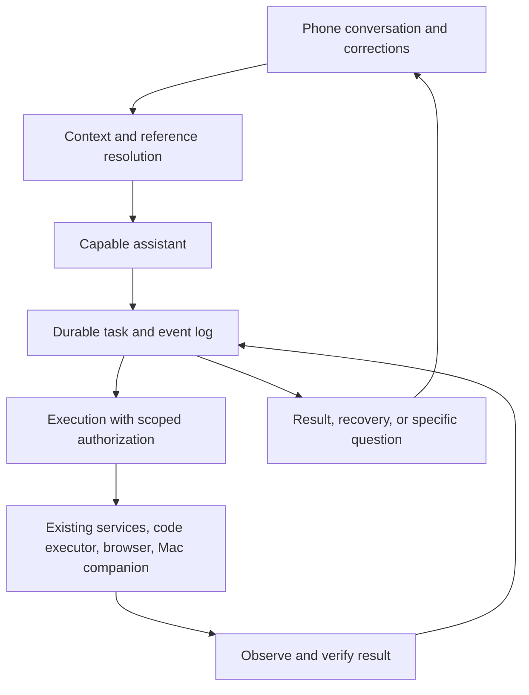

# Gajala: carry the user's outcome through to completion

Design and implementation record · 2026-09-11 · First vertical slice implemented

Implementation status: the first stages now provide durable assistant work with
idempotent request IDs and event history, correction/stop handling, restart
recovery, visible Gajala work cards, structured tool outcomes, exact routing
model IDs, truthful failure handling, and a verified clone-and-activate project
workflow. The Mac companion, general browser control, TV pilot, complete
research-to-queue workflow, and writing evaluator remain future stages. The
The first server/app slice is implemented; a real phone walkthrough remains.

Gajala should make the phone a dependable place to get things done on the Mac.
The user should be able to speak roughly, correct themselves, leave the app,
and return to either a verified result or a specific, actionable blocker.
The measure of success is less explaining, supervising, and returning to the
monitor. Adding capabilities alone has not delivered that experience.

## Evidence and limits

The local conversation store contains 136 app requests from August 1 through
September 10, 2026, including 40 from August 17 onward. This review examined
recent conversation chains, all 35 available app run traces (August 17–September
10), the implementation, and the prior Codex session
`019f6907-4442-7111-bde0-371134e231b2`. Synthetic test sessions such as `s1` and
`s-brain` were excluded. Repetition is a signal to investigate, not automatically
proof of a defect: ordinary revisions and intentionally repeated actions exist.
These are selected qualitative cases, not a measured overall failure rate.

Evidence references below are local `conversations.id` ranges and `runs.id` values.
The design deliberately omits raw transcript exports, personal addresses, and
private attachments. No historical requests were re-executed during this audit.

| Request chain | Observed behavior | What needs to change |
| --- | --- | --- |
| Play devotional songs and cast/extend to the TV; 12 user messages on September 10 (934–957) | Opened a search page; repeatedly dispatched unsupported `mac cast…` strings; returned help text. Later `open` attempts treated display settings names as file paths. Claimed missing permissions without testing permissions. | Track playback and display connection as separate completion conditions. Inspect available controls and real errors. Diagnose missing capability separately from denied access. |
| Clone a repo and open its project; 8 messages on August 23 (902–915) | Two “cloned” claims. Neither clone attempt invoked a Git-capable executor. Calls included opening GitHub, passing `git clone` to `mac`, inventing a `git` tool, and treating a clone command as a file path. | Use a capable execution path, verify destination and remote, then activate the project. A success sentence cannot substitute for an observed result. |
| Turn research task #19 into all implementation tasks; 3 messages on August 17 (864–869) | Asked the user where Gajala's own report was; created one setup draft, then another setup draft and a roadmap file. Did not create the requested full queue of dependent implementation jobs. | Resolve internal references before delegation, pass the actual report, preserve the full requested deliverable, and verify created queue records. |
| Rewrite a personal post; 4 messages on September 3 (916–923) | Hype first, then bland, near-identical rewrites despite corrections. No tools were called in these turns. | Give writing its own quality path, retain the original draft and accumulated editorial direction, and evaluate substantive improvement. |
| Explain two terms; September 9 (930–933) | A 600-second Gemini timeout followed by an unsourced answer that described a JavaScript engine while calling both terms AI models. | Start with proportionate lookup, retrieve relevant prior context, disambiguate names, and recover without making the user downgrade the request. |
| Inspect a project's remaining work and queue it overnight; August 16 (800–807) | Repeated switching and file listings; a fabricated attachment path; seven-step exhaustion. The same complete request was sent twice. | Preserve owner responsibilities, target project, scheduling intent, and completion criteria together. Earlier project-switch fixes help but do not provide outcome continuity. |
| Save supplied text; August 7 (740–761) | Raw JSON, repeated requests, then instructions to paste the text again even though it was already in the conversation. | Retrieve the original source and verify the saved artifact, preserving verbatim content when asked. |
| Queue work stuck for days; earlier session and August 8–11 chat | Repeated status and merge troubleshooting from the phone and monitor. Existing supervisor/deployment fixes address parts of this. | Extend durable execution and recovery to everyday assistant work, and distinguish a stored status from a live worker or verified deployment. |

Key traces: clone `d0f2d6e88abb48d7`, retry `f2bf484056e44a4e`, first TV turn
`e0b7e58d61df4f40`, failed display opening `8d324650d4844558`, report handoff
`4e19171f0087488d`, implementation queue `a2d4c0d6040e4da8`.

## Why the current design produces this experience

1. **The general assistant is a constrained router.** It selects a tool or emits
   a final JSON reply. All 35 app traces record `openai`. The inspected `.env`
   selects `SHELL_LLM_PROVIDER=openai`; the configured code default for that path
   is `gpt-4o-mini`. Historical traces record providers, not exact model IDs, so
   the precise model of each past call cannot be proved. The pinned coding model
   is separate and only helps after the router delegates correctly.
2. **Its memory is a clipped transcript.** `shell._format_context` limits every
   message to 600 characters; default history is 12 turn pairs. Tool results are
   clipped to 2,500 characters. There is no durable everyday task record carrying
   the full source, unfinished obligations, corrections, and approval scope.
   The research handoff also passes a task number to a CLI without resolving it.
3. **Tool completion and user success are conflated.** `Skill.run` returns a
   string. `_run_step` and streamed events infer success from whether it starts
   with `ERROR`. `[mac] open failed`, `Path not found`, timeout messages, and
   usage text can all look successful. A model can finish with an unsupported
   claim regardless of those results.
4. **Loop prevention does not produce recovery.** Repeated calls are replayed
   for free, but still consume the 20-round hard cap. The first TV request made
   one actual URL-open call and 19 duplicate decisions. Its final reply said it
   used all ten steps. The router never changed strategy.
5. **Capabilities have a ceiling that the prose hides.** The current `mac` skill
   supports a fixed command list, including URL open, wake, screenshot, and
   Bluetooth. It has no general UI interaction or display-extension action.
   The prompt nevertheless says never to claim lack of access. That encourages
   confident answers about capabilities that the tool cannot perform.
6. **Presentation preferences conflict with the task.** The persona explicitly
   encourages hype and teasing repeated questions. Writing is also handled by
   the routing reply path. Neither choice respects corrections such as “calm,
   human, like I wrote it” by default.
7. **Continuity stops at process boundaries.** Streams keep workers alive after
   a phone disconnect, which is useful. Everyday work still runs in in-memory
   asyncio tasks. The app queues later messages as separate turns; they do not
   steer the currently running action. Night Shift has richer durable recovery,
   but that does not cover ordinary assistant turns.

The launchd plist points to managed runtime `deploy-28`. Its `shell.py` and
`mac.py` match this checkout, confirming these findings apply to the inspected
runtime source. Its config differs from the owner checkout; configuration and
deployment identity need to be visible in diagnostics. No running process
environment or actual TV permission state was probed.

## Proposed experience

Open Gajala directly into the conversation and active work. A compact line shows
Mac connection and relevant project; project selection is optional for general
writing, research, and home tasks. Keep tools and model choices available in a
secondary library/settings surface. Retain useful one-tap Mac controls.

Work appears in a small card with the requested outcome, current meaningful
action, completed parts, and an artifact or precise blocker. Progress should say
“Checking whether the repository exists” rather than expose router iterations.
Detailed evidence remains expandable. The user can stop, correct, or resume the
same work from that card. Existing notes, queue jobs, notifications, and project
threads remain accessible and linked.

Examples describe target behavior, not outcomes achieved during this review:

- “Clone this and work on it” starts one task: clone, verify the destination and
  remote, activate the project, open/resume its session. The reply links the
  project and reports what was verified. No request to refresh the folder.
- “Read #19 and create all implementation tasks” resolves the queue report,
  builds dependent work orders, reads back their IDs and coverage, and reports
  which are ready or held under the existing queue policy. A roadmap document
  alone does not complete the request.
- “Make it sound like me” edits the full original with the user's corrections.
  It returns usable writing directly. Subsequent “too bland” refines the same
  draft while retaining “calm, personal, no hype.”
- “Play these songs on my TV” inspects available playback and display controls,
  chooses an actual video, and attempts the supported route. If blocked, it names
  the tested limitation and preserves the remaining task. Opening a search page
  is reported as an intermediate step, never as music playing on the TV.
- “Yes, do it” continues the specific pending action. “Not manual, through
  Gajala” changes the approach on that same task. Neither discards earlier intent.

The feeling to aim for is dependable follow-through, with personality that fits
the moment. Celebrate verified results sparingly. Repeated requests trigger
attention and recovery, never a roast. Avoid generic “let me know if you want to
proceed” after the user already requested that action.

## A continuous assistant with durable work and observable tools

**One assistant owns the conversation.** Use a capable general model to
understand and carry ordinary work, writing, and ambiguous requests. Keep cheap
deterministic paths for explicit controls and simple reads. Select models using
the replay cases below, measuring completion, latency, and total cost per outcome.
A cheap model that needs 20 decisions may be the expensive path. Existing CLI
subscriptions remain valuable executors, with their sessions preserved. A
one-line rewritten delegation must not lose the original request or attachments.

Start with one coordinator and adapters over current infrastructure. Additional
autonomous agents are not a prerequisite. A stronger model helps, but cannot
replace missing tools, reliable state, or result verification. Grounding each
step in environmental feedback and keeping the execution pattern simple follows
[Anthropic's agent design guidance](https://www.anthropic.com/engineering/building-effective-agents).

**Store a task independently of a chat turn.** Persist an ID, original request,
revision, project/resource bindings, resolved references, constraints, completed
and remaining outcomes, authorization scope, last evidence, and next action.
Use append-only events for user corrections, execution, approvals, observations,
and status changes. A normal short answer need not create a visible queue job.
Only ongoing actions need a work card; explicit “save an idea” remains capture.

Use states such as `accepted`, `working`, `recovering`, `waiting_for_user`,
`completed`, `failed`, and `cancelled`; keep outcome completion separate from
transport success. Existing Night Shift jobs link into this record and remain
the authority for queue execution and deployment. Do not create a second,
competing deployment coordinator or reinterpret existing held Drafts as approved.

Persist before acknowledgement; attach a client request ID so reconnection does
not create duplicate work. Workers claim leases and checkpoint between actions.
After a restart, reconcile the last action with actual external state before
retrying it. A lost response can mean an action succeeded: use idempotency keys
where supported, read-back checks elsewhere, and pause if a consequential effect
cannot be determined. Never promise universal exactly-once execution.

**Resolve context before asking the user.** Attach the full current source or an
artifact reference, the active task, recent corrections, project context, and
fresh relevant state. Look up `#19` in the referenced task domain; resolve “that
repo” from the active task. If two references remain plausible, ask one precise
question. Use SQLite lookup/search first; a vector database is not required.
Persist explicit style preferences with provenance and an edit/remove control.
Do not silently treat quoted documents or inferred preferences as authorization.

**Expose structured tools with trustworthy observations.** Introduce typed
inputs and results alongside the legacy string interface, preserving direct
slash commands. A result should distinguish `succeeded`, `failed`,
`unsupported`, `needs_permission`, `not_found`, and `unknown`, with data, error
code, observed time, resource, evidence references, and whether anything changed.
Legacy results of uncertain meaning remain `unknown`, never implicitly success.

For example, `projects.clone(url, destination)` must produce the canonical path,
exit status, and observed Git origin. `queue.get(id)` must expose the complete
report/artifact rather than a shortened display summary. Browser playback and
Mac UI actions need observations after execution. No-op polling and cached
results must not appear as fresh progress. Receipt assertions must match their
scope: a cloned repo does not prove a development session was opened.

**Recovery reacts to lack of progress.** One identical no-progress attempt
returns prior evidence; a second forces a different plan, stronger reasoning
path, or a precise blocker. Bound total elapsed time and cost, and retry only
when the failure and action make retry sensible. Preserve what succeeded.
Budget exhaustion leaves an honestly resumable task; it must not produce a
fabricated success recap. If providers fall back, retain the same task state and
capability constraints. Record exact model IDs and recovery reason in the trace.

**Treat new messages as steering.** Link messages to a task ID and revision.
“Stop” prevents new actions immediately and cancels interruptible work; reconcile
an action already in flight. Corrections become the next execution revision.
An answer to a pending question carries that question's ID and scope, so an old
“yes” cannot authorize an unrelated action. Necessary read-only diagnosis and
already-authorized actions proceed without repeated permission questions.
External communications and new consequential scope still need the appropriate
authorization. Phone disconnect is neither cancellation nor fresh approval.

## Cover the work that currently sends the user back to the monitor

The execution layer needs three complementary routes: direct APIs/CLIs for
structured operations, a browser for websites, and a Mac companion for native
applications. The assistant chooses based on the actual task and available
capabilities. Do not force every activity through the narrow `mac` command parser.

A Mac companion should run in the user's GUI session with a stable app identity,
report capability readiness, inspect the accessibility tree, capture the screen
when needed, and perform targeted actions with observed results. Serialize shared
desktop interaction and detect when the user takes over. Locked screen, missing
application support, permission denial, and unavailable device are different
states. Device discovery must establish the TV model/protocol; the historical
chat does not establish AirPlay support or prove which permission was absent.

macOS has separate controls for
[Accessibility](https://support.apple.com/guide/mac-help/allow-accessibility-apps-to-access-your-mac-mh43185/mac),
[Automation](https://support.apple.com/en-mide/guide/mac-help/mchl07817563/mac), and
[screen/audio recording](https://support.apple.com/en-ie/guide/mac-help/mchld6aa7d23/mac).
The implementation must request only the controls its chosen route needs, test
them under the real companion identity, and show the precise remaining setup.
Some initial OS grants or physical device actions may still require the owner.
The target is broad, dependable coverage with specific limits; “anything a human
can do, unattended” is not an honest universal guarantee.

For the TV case, first prove a narrow slice on the actual hardware: discovery,
playback, supported connection mode, and an observable connected/playing state.
Do not declare success from opening a URL, waking the display, or enabling
Bluetooth. Those historical actions do not establish display connectivity.

## Build order and release gates

| Stage | Deliverable | Gate before expanding |
| --- | --- | --- |
| 1. Truthful execution | **Partial:** structured result contract, verified clone, legacy failure classification, exact model logging, honest failed-action reply | Clone success/failure cases pass; migrate remaining skills and add the unsupported-TV route |
| 2. Continuity and reasoning | **Partial:** durable tasks/events, correction linkage, visible work state, Claude Sonnet restored as primary general brain | Add reference resolution, full-source handoff, writing evaluator, and report-to-queue acceptance cases |
| 3. Survive interruption | **Partial:** request deduplication, restart orphan recovery, stop/steer API and app behavior | Add leased cross-process workers and deeper external-effect reconciliation |
| 4. Phone experience | Conversation as home, active work cards, actionable questions, artifact links, tools in a secondary surface | Real phone walkthrough needs no manual refresh or command knowledge |
| 5. Mac/browser reach | Companion readiness, observable browser/native actions, actual TV pilot | Real hardware walkthrough verifies playback/display outcome or names a tested blocker |

These stages are implementation boundaries, not separate product initiatives.
Ship them incrementally behind a per-session feature flag, preserving old clients
and the current queue/deployment coordinator. Never shadow-execute mutations for
comparison. Compare alternative reasoning paths in sandbox fixtures first.
Record runtime commit/config identity so tests and the phone target the same
release. Server rollout must use the existing verified deployment process.

Likely code boundaries: `server/skills/base.py` and adapters for structured
results; a task/event store under `server/db/`; a coordinator separate from the
legacy shell parser; task/event/steering endpoints in `server/api_v2.py`;
`chat_controller.dart` for durable task IDs and correction delivery; home/chat
widgets for work cards; `mac_helpers/` for the companion. Retain
`workspace.active()` as execution authority; each action binds its explicit
resource context without changing another conversation's workspace.

## Acceptance scenarios drawn from the user's experience

Use synthetic repositories, reports, and personal text in automated fixtures.
Never replay historical mutations against the live Mac or queue. Test negative
paths as well as success. These are proposed acceptance cases, not tests run or
passing today.

| Scenario | Required evidence |
| --- | --- |
| Clone, then “work on it” | Correct remote and destination exist, project resolves, native session attaches; absent/unreachable repository never yields “cloned” |
| Clone response lost, phone retries | Same request ID, reconciled existing checkout, no second clone or duplicate task |
| Task #19 research → full implementation queue | Report fetched internally; one setup task, all requested work represented, correct dependencies/projects; queue IDs read back; existing review policy retained |
| Draft → “calm, like me” → “too bland” | Full original preserved; both corrections retained; materially changed draft; no added claims or hype. Owner evaluates voice |
| Play music and extend display | Separate playback and connection observations; unsupported action/help output cannot count as success |
| Ask which permission is missing | Specific tested denial, or explicitly unknown/unsupported; no inference from a file-not-found error |
| “Yes” after a pending action | Same task/question continues once; no repeated “shall I?” and no unrelated approval |
| “Not that project” while running | Correction applied before next action; in-flight effect accounted for; no silent edits to the wrong project |
| “Do my part only; queue tonight” | Owner-responsibility and schedule constraints persist in every created work order |
| “What are these terms?” after a timeout | Context/lookup or a narrow disambiguation; bounded recovery; no unsourced invented identity |
| Save this exact text, then reopen | Artifact exists and content matches; link works on phone; no demand to paste the available original again |
| Background phone, restart worker, then resume | Durable state restored; partial effects reconciled; real progress shown; final artifact accessible |
| Worker cannot make progress | Bounded retries, distinct failure category, remaining outcome visible; no generic “continue” loop |
| “Stop” followed by a stale question answer | No new action from cancelled task; stale approval rejected; already-started effect reconciled |

Start with an offline replay harness around these cases and current behavior.
Then run the smallest real phone pilots. Measure verified completion without
restatement, false success, repeated authorization questions, recovery success,
time to first useful progress, total task cost, and monitor interventions. Label
intentional writing iterations separately from corrective repetition.

Initial release criteria: zero false success in the fixture suite; no more than
one clarification when a required detail is genuinely unavailable; no repeated
confirmation for the same authorized scope; successful interruption recovery in
all tested failure windows. For subjective quality, the owner should accept
writing and task handoffs in real use. Do not replace that judgment with green
unit tests or claim a measured satisfaction improvement before a phone trial.

The first implementation should be a complete vertical slice through stages
1–3 for “clone this repo and open it,” with the report and writing cases following.
This proves reasoning, action, verification, and continuity together before
expanding to general desktop automation or redesigning every screen.
